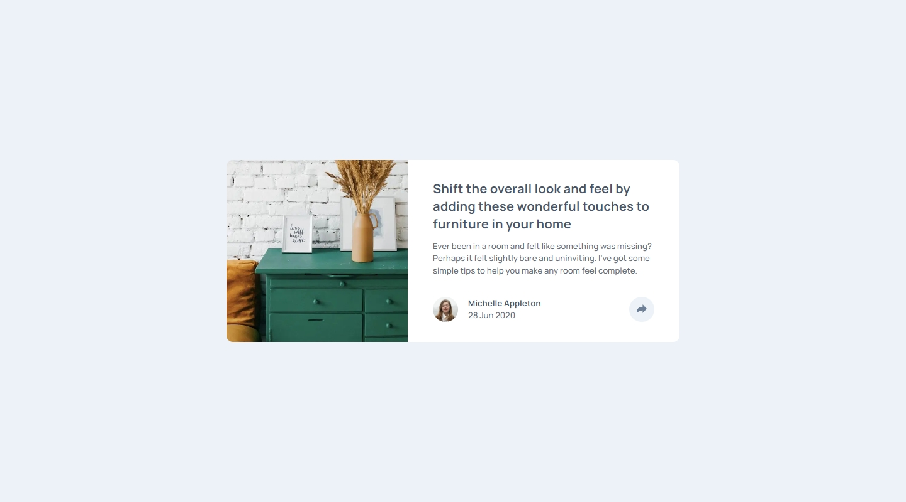
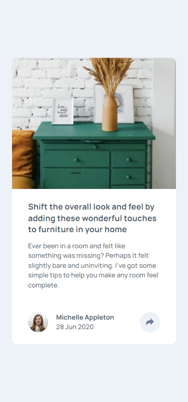
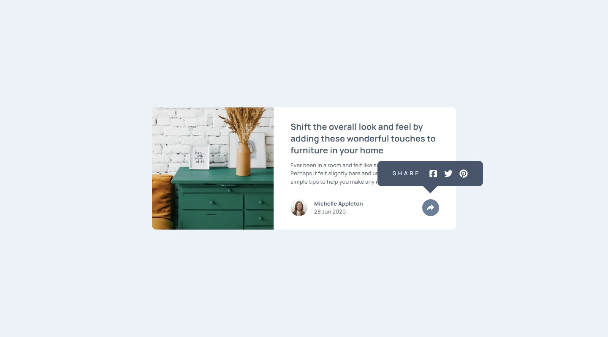

## Frontend Mentor Challenge 23 - Article Preview Component

This is my solution to the [Article Preview Component](https://www.frontendmentor.io/challenges/article-preview-component-dYBN_pYFT) challenge on [Frontend Mentor](https://www.frontendmentor.io/).

#

### Links. 🔗

- Live Site URL: https://article-preview-component-darkstarxdd.vercel.app/

#

### Screenshots of the Solution (Desktop, Mobile and Popover open state). 🔍

#

### Built with. 🔨

- HTML & CSS.
- TypeScript.
- Vite.

#

### New Things Learned. 🎓

- To allow images to scale beyond their original file dimensions, you have to use `width: 100%` rather than `max-width: 100%`. For example, an image sized at `576px X 576px` won’t expand beyond `576px` if `max-width: 100%` is applied.
- Inline SVGs need to have the `viewBox` attribute. Without it, the SVG won’t scale with the browser’s root font size, even if you’ve set its `width` and `height` in `rem` within CSS.

#

### Testing and Accessibility. 🧪

- Tested site usability with keyboard-only navigation.
- Used the Responsively App to check the site's appearance on various screen sizes, from 320x480 to 3000x2000.
- Set the browser font size on desktop to various values ranging from 9px to 72px to make sure everything on the site scales properly with the user's preferred browser font size.
- Zoomed the page in and out using Ctrl + Scroll wheel (up to 500%).
- Tested with the NVDA screen reader.
- Viewed the site on an iPhone 11 in both portrait and landscape modes.
- Performed Lighthouse and PageSpeed tests. ([PageSpeed Result.](https://pagespeed.web.dev/analysis/https-article-preview-component-darkstarxdd-vercel-app/9y06oyno2b?form_factor=mobile))

#

### Some Tools I Use. 🔧

- [Responsively.app](https://responsively.app/) - A free and open source tool that allows you to test your webpage on different screen sizes, take screenshots and much more.

- [Favicon.io](https://favicon.io/) - Generate favicons.

- [Google Webfonts Helper by Mario Ranftl](https://gwfh.mranftl.com/fonts) - Provides WOFF2 format for Google Fonts.

#

- My Frontend Mentor Profile - [@DarkstarXDD](https://www.frontendmentor.io/profile/DarkstarXDD)
